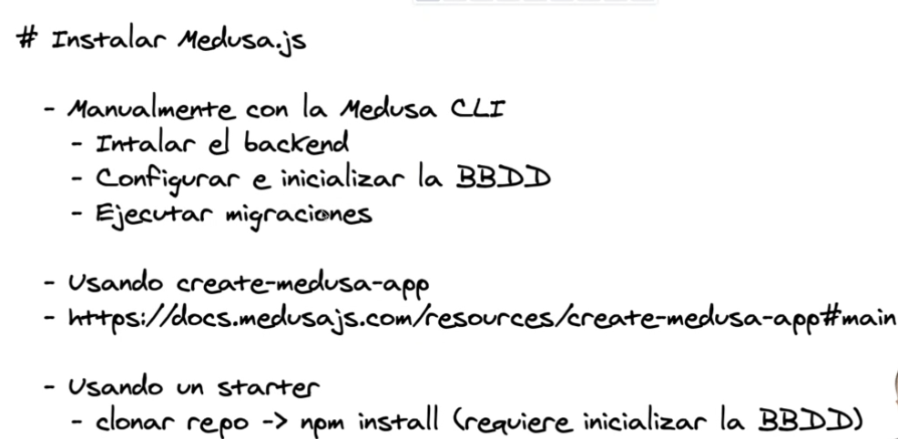
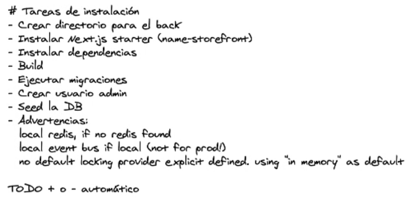

# medusa_js_project
Inicio de Proyecto aprendiendo y utilizando Medusa.js

¿Que es Medusa JS?
Es un headless e-commerce, o sea, es un backend para e-commerce.

¿Cual es la idea del headless? => Trabajo sobre el backend, el cual el frontend va a consumir mediante CRUD.

HTTPS://medusajs.com/

¿Cual es la idea de tener un e-commerce headless?

Incluye funcionalidad core de e-commerce
- Gestion de productos
- Procesamiento de órdenes
- Gestión de inventario
- Gestion de Clientes
- Integraciones para pagos y envios.
- Notificaciones

PROS:
- Fue diseñado específicamente para e-commerce.
- Trae incluido: carrito, flujo de checkout, catálogos.
- Personalizable:
    - Arquitectura backend basada en servicios
    - soporte de TypeScript
- Headless: se puede combinar con cualquier tecnología front-end. Ejemplo: next.js, Gatsby, Astro.

Contras:
- Madurez limitada: es relativamente nuevo, en comparacion con plataformas como Magento, Shopify, o WooCommerce.
- Comunidad de menor tamaño. 
- Requiere mayor esfuerzo de parte del desarrollador. 
- Enfoque DIF (Do It Yourself)
- Ecosistema limitado / Integraciones.
    - Menos integraciones disponibles: Se puede integrar con procesadores de pago, pero requiere más esfuerzo. Ej. MercadoPago.
    - No soporta todos lo procesadores de pago. 
- Performance y escalabilidad. Su escalabilidad no está probada a nivel de la competencia. 
- Responsabilidad de la infraestructura
- Menos herramientas de marketing.
    - No tiene herramientas como recuperacion de carros de compra abandonados, email marketing, programas de fidelización.
    - Se pueden integrar de terceros o desarrollar propias.
- Curva de aprendizaje elevada. 
    - Es una plataforma developer-first (no user-first)
    - No incluye templates
    - Si incluye ejemplos. 

> Instalar Medusa.js
    
    - usando create-medusa-app

> Tareas de instalación
